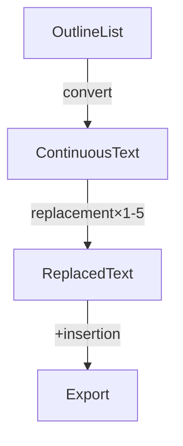

# Obsidian Outline Converter Plugin

- Obsidian Outline Converter Plugin
	- Features
		- This plugin converts bullet list outlines into continuous text.
		- You can use two commands: `Auto-header converter` & `Custom converter`
	- Installation
		- You can download from `Community plugins` in Obsidian settings.
	- Commands
		- You can choose to convert selected text, or if none is selected, all content in the active note will be accessed.
		- Auto-header converter
			- It automatically determines whether the text is a header or a sentence.
		- Custom converter
			- Customize how text is handled at each indentation level from 1 to 5.
			- Options include inserting text before or after content, ignoring content and using line breaks.
	- Replacement
		- You can search & replace terms as you like before outputting the connected sentences.
		- {{break}}
		- Double line breaks are inserted before this sentence, as I configured.
	- Insertion
		- You can use `{{i:id}}` as insert anything in the active file.
		- {{i:mermaid}}
		- `{{i:id}}` is replaced with content between `{{s:id}}` and  `{{e:id}}`.
	- Select export method 
		- Choose from the following options for exporting your text:
		- Copy to clipboard.
		- Append to the cursor's current position.
		- Append to the bottom of the active note.
		- Replace a section; if none exists, create it at the bottom of the note.
	- Other commands
		- Fold all of indentation levels 1-5.
		- Swap lines commands
			- In bullet lists, it uses line swapping commands of the Outliner plugin.
			- Outside of that, it simply swaps lines.
	- Note
		- The command of `Auto-header converter`  can convert this outline into the text below. 

{{s:mermaid}}

{{e:mermaid}}
# Output

## Obsidian Outline Converter Plugin

### Features

This plugin converts bullet list outlines into continuous text. You can use two commands: `Auto-header converter` & `Custom converter` 

### Installation

You can download from `Community plugins` in Obsidian settings. 

### Commands

You can choose to convert selected text, or if none is selected, all content in the active note will be accessed. 

#### Auto-header converter

It automatically determines whether the text is a header or a sentence. 

#### Custom converter

Customize how text is handled at each indentation level from 1 to 5. Options include inserting text before or after content, ignoring content and using line breaks. 

### Replacement

You can search & replace terms as you like before outputting the connected sentences. 

 Double line breaks are inserted before this sentence, as I configured. 

### Insertion

You can use `{{i:id}}` as insert anything in the active file. 

`{{i:id}}` is replaced with content between `{{s:id}}` and  `{{e:id}}`.

### Select export method

Choose from the following options for exporting your text: Copy to clipboard. Append to the cursor's current position. Append to the bottom of the active note. Replace a section; if none exists, create it at the bottom of the note. 

### Other commands

Fold all of indentation levels 1-5. 

#### Swap lines commands

In bullet lists, it uses line swapping commands of the Outliner plugin. Outside of that, it simply swaps lines. 

### Note

The command of `Auto-header converter`  can convert this outline into the text below. 